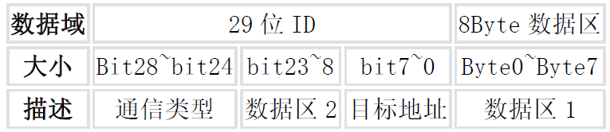
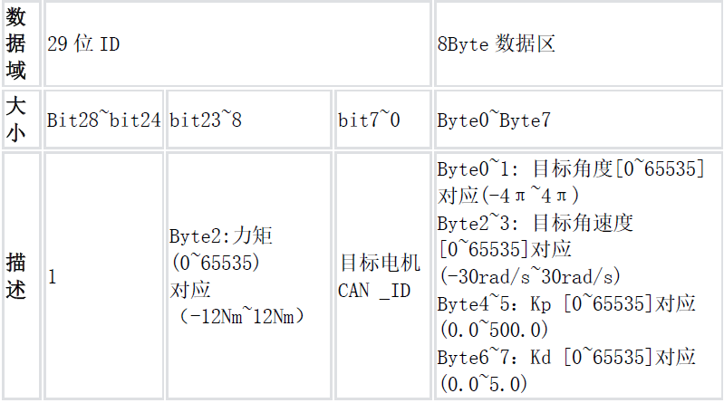
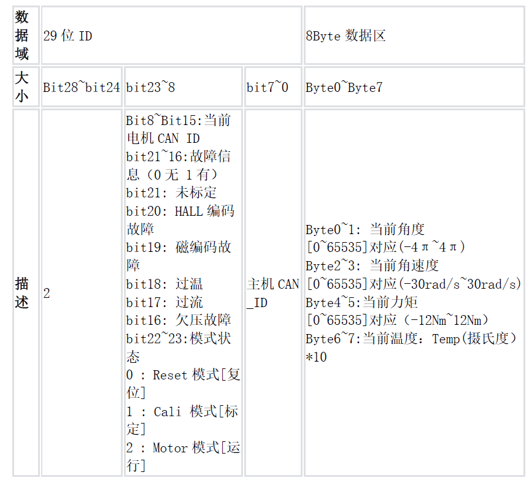

# 使用方法

## 编辑`CmakeLists`

```cmake
target_sources(${CMAKE_PROJECT_NAME} PRIVATE
    sp_middleware/motor/cybergear_motor/cybergear_motor.cpp # <- 添加这一行
)

target_include_directories(${CMAKE_PROJECT_NAME} PRIVATE
    sp_middleware/ # <- 添加这一行
)
```

## 原理说明

小米电机使用的拓展帧格式如下  
  
可以看出29位的帧头部分包括通信类型、数据区2和目标地址三种数据，数据区则与标准can没有区别，都是 8 byte = 64 bit。
其与标准can最大的区别在于帧头部分包含了有用的数据，29位帧头信息全部保存在`tx_header.ExtId`或者`rx_header.ExtId`中,而 8 Byte数据区中的内容则保存在can结构体的`can.tx_data`或者`can.re_data`中。 

发送数据时，由于`void CAN::send(uint32_t tx_id)`传入参数过少，为了保持标准帧的可用性，拓展帧的发送使用新的函数
`void CAN::send_ext(uint8_t communication_type, uint16_t torque,  uint8_t motor_id, uint8_t master_id)',传入这4个参数的原因是  
- 控制帧和反馈帧的帧头都包含`communication_type`即通信类型，这个数据只能通过`tx_header.ExtId`发送，所以在帧发送时传入`communication_type`以构建`tx_header.ExtId`  
- 发送控制指令即`communication_type = 1`时，力矩是包括在帧头中的，如下图所示，所以需要传入  
  
- 除了`communication_type == 1`的情况外，每一个发送帧的帧头都包含目标电机ID和主机CAN_ID  

接收数据时，只需要识别`rx_header.IDE`是否为`CAN_ID_EXT`，据此改变`can1.frame_type`，然后进入标准帧的`read`函数或者`CyberGear.read(uint32_t header, uint8_t * data, uint32_t stamp_ms)`即可。

## 发送数据（以电机使能为例）

假设已经实例化了一个`CyberGear`电机为`pitch_motor`  
- 1、先调用`cmd`函数将通信类型和需要发送的参数写入电机的结构体  
- 2、调用`CyberGear.write()`，根据通信类型修改 8 Byte数据区的内容  
- 3、调用`can1.send_ext()`，创建帧头信息和发送`mail`，修改帧头信息后发送  
```cpp
    pitch_motor.cmd_motor_enable();  //电机使能  
    pitch_motor.write(can1.tx_data);  
    can1.send_ext(pitch_motor.communication_type, 0, pitch_motor.motor_id, pitch_motor.master_id);  
```  
常用的命令帧包括单个参数读写、电机使能和发送力矩，其他的虽然写了但实际并未使用，欢迎自由探索  

## 接收数据

在回调函数`void HAL_CAN_RxFifo0MsgPendingCallback(CAN_HandleTypeDef * hcan)`中识别`hcan`并调用对应的`can.recv()`,
当`can1.frame_type == 1`即收到的是拓展帧时调用`CyberGear.read(can1.rx_id, can1.rx_data, stamp_ms)` 
```cpp
void HAL_CAN_RxFifo0MsgPendingCallback(CAN_HandleTypeDef * hcan)  
{  
  auto stamp_ms = osKernelSysTick();  // 获取当前的系统时间戳（以毫秒为单位）  
  while (HAL_CAN_GetRxFifoFillLevel(hcan, CAN_RX_FIFO0) > 0) {  
    if (hcan == &hcan1) {  
      can1.recv();  
      if (!can1.frame_type) {  
        if (can1.rx_id == fric_motor1.rx_id) {  
          fric_motor1.read(can1.rx_data, stamp_ms);  
        }  
      }  
      else if (can1.frame_type) {  
        pitch_motor.read(can1.rx_id, can1.rx_data, stamp_ms);  
      }  
    }  
  }  
}  
```

## CyberGear特性 重要！！！！！
- 1、C板上电速度比电机快，如果只在初始化的时候使能电机，电机是收不到使能帧的，必须加入电机掉线检测或者循环使能到电机有反馈才行。  
- 2、电机上电后只是使能的话会让电机进入Reset模式，也就是`CyberGear.mode == 0`，此时电机反馈也为通信类型2，可以知道位置速度等参数，
但是反馈的主机`CAN_ID`错误，需要通过单个参数写入的命令设置`run_mode = 0`即运控模式，然后再次使能，此时`CyberGear.mode == 2`为正常，可以参考以下代码  
  
```cpp  
void pitch_init()  
{  
  pitch_motor.cmd_set_single_parameter(run_mode, 0);  //设置为运控模式  
  pitch_motor.write(can1.tx_data);  
  can1.send_ext(pitch_motor.communication_type, 0, pitch_motor.motor_id, pitch_motor.master_id);  
  osDelay(1);  
  pitch_motor.cmd_motor_enable();  //电机使能  
  pitch_motor.write(can1.tx_data);  
  can1.send_ext(pitch_motor.communication_type, 0, pitch_motor.motor_id, pitch_motor.master_id);  
}  
```  
- 3、电机上电后会自动发送通信类型0报告电机`CAN_ID`和64位MCU唯一标识符，可以通过Pcan-View获得电机`CAN_ID`  
