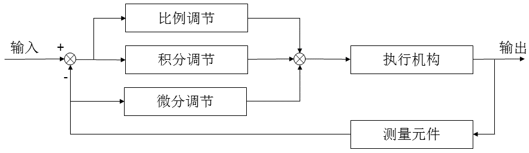

# 使用方法

### 编辑`CMakeLists.txt`

```cmake
target_sources(${CMAKE_PROJECT_NAME} PRIVATE
    sp_middleware/tools/pid/pid.cpp # <- 添加这一行
)

target_include_directories(${CMAKE_PROJECT_NAME} PRIVATE
    sp_middleware/ # <- 添加这一行
)
```

### 初始化
```cpp
sp::PID motor_pid(dt,kp,ki,kd,max_out,max_iout,alpha,angular,dynamic);
```
`dt`: 循环周期，单位为s

`kp`: 比例系数

`ki`: 积分系数

`kd`: 微分系数

`max_out`: 最大输出

`max_iout`: 最大积分输出

`alpha`: 滤波系数

`angular`: 是否为角度控制

`dynamic`: 是否开启动态积分

### 调用

```cpp
motor_pid.calc(set,feedback); 
```

### 查询结果

```cpp
ans = motor_pid.out;
```

# 原理
## 传统PID
### P-比例环节：
  - 功能：比例部分基于当前的误差计算控制输入。误差越大，控制输入越大。
  - 效果：可以快速减小误差，但通常会留下一个稳态误差。
  - 数学表达：
  $$P_{out} = K_p \times?e(t)$$
  - 其中 $K_p$ 是比例增益， $e(t)$ 是当前误差。 

### I-积分环节；
  - 功能：积分部分基于误差的累积值计算控制输入。目的是消除稳态误差。
  - 效果：可以消除长期误差，但可能导致系统响应变慢和超调。
  - 数学表达：
  $$I_{out}=K_i∫e(t)dt$$
  - 其中 $K_i$ 是积分增益。 

### D-微分环节：
  - 功能：微分部分基于误差的变化率计算控制输入。目的是预测误差的变化趋势，从而提前调整控制输入。
  - 效果：可以减小超调和振荡，但可能导致系统响应变慢。
  - 数学表达：
  $$I_{out}=K_i∫e(t)dt$$
  - 其中 $K_i$ 是积分增益。

## 优化

### 梯形积分
- 由于积分环节的累积误差可能导致积分饱和，因此采用梯形积分来代替矩形积分，以减小积分饱和的风险。
$$I_{out}=\frac{1}{2}K_i(t_{now}-t_{last})\times(e(t)-e(t-1))$$
- 其中 $t_{now}$ 和 $t_{last}$ 分别为当前时刻和上一时刻， $e(t)$ 和 $e(t-1)$ 分别为当前时刻和上一时刻的误差。

### 动态积分
- 由于积分环节的累积误差可能导致积分饱和，因此采用动态积分来调节积分增益，以减小积分饱和的风险。
- $$K_i(t)=K_i\frac{1}{1+e(t)}$$


### 一阶低通滤波
- 由于测量误差中可能包含噪声，KD项的计算可能会放大这些噪声，导致控制系统的不稳定。为了解决这个问题，可以通过对KD项进行滤波。

- 在此基础上采用一种简易的一阶低通滤波，其表达式为

$$d[i]=\alpha \times p[i] +(1-\alpha)\times d[i-1]$$

- 当前时刻的输出是当前时刻的输入和上一时刻的输出的加权平均。权重系数 $\alpha$ 决定了滤波器的截止频率： $\alpha$ 值越大，截止频率越高，对高频噪声的抑制能力越弱； $\alpha$ 值越小，截止频率越低，对高频噪声的抑制能力越强，但响应速度也越慢。

### 微分先行：

$$e(t)=set-ref$$

$$D_{out}=K_d\frac{de(t)}{dt}=K_d\frac{d(set)}{dt}+K_d\frac{d(ref)}{dt}$$

- 在指令频繁升降的场合， $\frac{d(set)}{dt}$ 会对微分结果产生较大的影响，因此在微分先行PID中只对输出量进行微分，而对给定指令不进行积分，结构图如下图所示：

